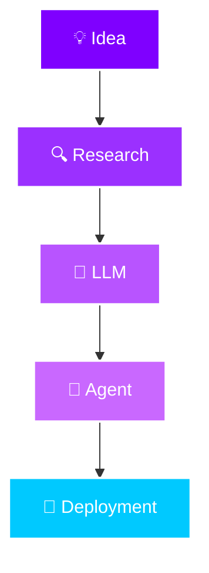

<div align="center">


<a href="https://git.io/typing-svg">
  
</a>

<br/>

<p>
  <a href="https://019bd04c-c745-7394-8d8a-c56f1e94c06a.arena.site"></a>
  <a href="https://linkedin.com/in/anmol-dhimannn"></a>
  <a href="mailto:your.email@example.com"></a>
  <a href="#"></a>
  <a href="https://github.com/anmoldhiman17"></a>
</p>


</div>


<h2 align="center">🧠 About Me</h2>

<table align="center" width="100%">
<tr><td>

I'm an AI Engineer who builds systems, not just demos. While most people stop at a notebook that prints a clever output once, I'm interested in what happens when that idea has to survive real traffic, real users, and real edge cases — wrapped in an API, deployed, monitored, and still working at 3 AM.

My world revolves around **Large Language Models** and the architecture around them — retrieval pipelines that actually retrieve the right thing, agents that reason instead of hallucinate confidently, and multi-agent systems where each component has a job and does it well. I care less about chasing the newest model release and more about *composing* models, tools, and memory into something that solves an actual problem.

Currently pursuing my **B.Tech in Computer Science Engineering** at Quantum University, while spending my nights shipping side projects, contributing to open source, and occasionally publishing research — because the fastest way to learn AI engineering is to keep building things that break, then fixing them.

> *"I don't just want to use AI — I want to architect the systems that make AI useful."*

</td></tr>
</table>


<h2 align="center">🚀 What I'm Currently Building</h2>

<div align="center">

| 🔭 Focus Area | ⚡ Status |
|:---|:---|
| 🧬 **Generative AI** applications with multi-model orchestration | Actively shipping |
| 🤖 **Autonomous Agents** that plan, reason & self-correct | In active development |
| 🧠 **LLM-powered products** with production-grade reliability | Actively shipping |
| ⚙️ **FastAPI** backends serving AI at scale | Actively shipping |
| 📚 **RAG pipelines** with hybrid retrieval & re-ranking | Refining |
| 🌐 **Open Source** contributions to the AI tooling ecosystem | Ongoing |

</div>


<h2 align="center">🛠️ Tech Arsenal</h2>

<div align="center">

**Languages**
<br/>


**Generative AI & LLMs**
<br/>


**Machine Learning**
<br/>


**Backend & APIs**
<br/>


**Frontend**
<br/>


**Databases**
<br/>


**Deployment & DevOps**
<br/>


</div>


<h2 align="center">🧪 AI Expertise</h2>

<div align="center">

| Domain | Proficiency |
|:---|:---|
| 🤖 **LLM Applications** |  |
| ✍️ **Prompt Engineering** |  |
| 📚 **RAG Systems** |  |
| 🕸️ **Multi-Agent Architectures** |  |
| ☁️ **AI Deployment** |  |
| 🎛️ **Fine-Tuning** |  |
| 🧩 **Embeddings** |  |
| 🗄️ **Vector Databases** |  |
| ⚙️ **Workflow Automation** |  |

</div>


<h2 align="center">💎 Featured Projects</h2>

<table align="center" width="100%">

<tr>
<td width="50%" valign="top">

### 🧬 ResearchMind
Production-grade **Multi-Agent Research Platform** that autonomously plans, retrieves, and synthesizes research across the web into structured reports.

`FastAPI` `LangChain` `Mistral AI` `React` `TypeScript` `Tailwind` `Tavily` `Vercel`

<a href="#"></a>
<a href="https://github.com/anmoldhiman17?tab=repositories"></a>

</td>
<td width="50%" valign="top">

### 📄 NeuralDocs AI
A **RAG-powered PDF Assistant** that lets you have grounded, citation-aware conversations with dense, lengthy documents.

`LangChain` `ChromaDB` `Mistral` `Streamlit`

<a href="#"></a>
<a href="https://github.com/anmoldhiman17?tab=repositories"></a>

</td>
</tr>

<tr>
<td width="50%" valign="top">

### 🎭 Orion AI
A **Multi-Personality AI Chatbot** with persistent memory, capable of switching between distinct conversational personas mid-session.

`LangChain` `Mistral` `Memory` `Streamlit`

<a href="#"></a>
<a href="https://github.com/anmoldhiman17?tab=repositories"></a>

</td>
<td width="50%" valign="top">

### 🏙️ AI City Assistant
A location-aware assistant that fuses **live weather + maps data** with LLM reasoning to answer real-world, real-time city queries.

`Mistral` `Weather API` `Maps` `LangChain`

<a href="#"></a>
<a href="https://github.com/anmoldhiman17?tab=repositories"></a>

</td>
</tr>

<tr>
<td width="50%" valign="top">

### 🎬 MovieMind AI
An **AI Movie Intelligence** engine using advanced prompt engineering to deliver nuanced recommendations and deep-dive analysis.

`Prompt Engineering` `Mistral`

<a href="#"></a>
<a href="https://github.com/anmoldhiman17?tab=repositories"></a>

</td>
<td width="50%" valign="top">

### ✨ More on the way
New agentic systems, fine-tuning experiments, and open-source tooling are always in progress — check the pinned repos for the latest drops.

<a href="https://github.com/anmoldhiman17?tab=repositories"></a>

</td>
</tr>

</table>


<h2 align="center">📊 GitHub Analytics</h2>

<div align="center">


<br/><br/>


</div>


<h2 align="center">🏆 Achievements</h2>

<div align="center">

| Category | Highlight |
|:---|:---|
| 📜 **Research Publication** | Published ML Research Paper — IJPREMS |
| 💼 **AI/ML Internship** | Global Next Consulting India Pvt Ltd |
| 🐍 **Python Developer Internship** | Skybrisk |
| 🌐 **Full Stack Developer Internship** | Anonic Technologies |
| 🧠 **AI Projects Shipped** | 5+ production-style Generative AI applications |
| 🌱 **Open Source** | Active contributor across the AI tooling ecosystem |

</div>


<h2 align="center">⚙️ Development Workflow</h2>

<div align="center">



</div>


<h2 align="center">📡 Currently Learning</h2>

<div align="center">


</div>


<h2 align="center">🤝 Let's Connect</h2>

<div align="center">

<a href="https://linkedin.com/in/anmol-dhimannn"></a>
<a href="https://019bd04c-c745-7394-8d8a-c56f1e94c06a.arena.site"></a>

<br/>

<a href="https://github.com/anmoldhiman17"></a>
<a href="mailto:your.email@example.com"></a>

</div>

<br/>

<div align="center">

### 💬 Dynamic Quote


</div>

<br/>


<div align="center">

**"Building AI systems that solve real-world problems."**

</div>

<br/>

<details>
<summary>💡 <b>Setup &amp; Customization Notes</b> (click to expand — remove this section once done)</summary>
<br/>

- **Email & Resume:** Replace `your.email@example.com` and the `#` Resume link with your real email and resume URL (Google Drive / PDF link works great).
- **Project links:** Each project's "Live Demo" currently points to `#` and "View Code" points to your repositories tab. Swap in the exact repo / deployed URL for each project once available.
- **Snake contribution animation:** To add the animated contribution snake, create a repo named exactly `anmoldhiman17` (your username) if you haven't already, then add this GitHub Action at `.github/workflows/snake.yml`:

  ```yaml
  name: snake
  on:
    schedule:
      - cron: "0 0 * * *"
    workflow_dispatch: {}
    push:
      branches: [ main ]
  jobs:
    generate:
      runs-on: ubuntu-latest
      steps:
        - uses: Platane/snk@v3
          with:
            github_user_name: anmoldhiman17
            outputs: dist/github-contribution-grid-snake.svg
        - uses: crazy-max/ghaction-github-pages@v4
          with:
            target_branch: output
            build_dir: dist
          env:
            GITHUB_TOKEN: ${{ secrets.GITHUB_TOKEN }}
  ```

  Then add this to wherever you'd like the snake to appear:
  ```md
  
  ```
- **Reliability note:** The free public instances of `github-readme-stats`, `streak-stats`, and `github-profile-trophy` occasionally rate-limit or pause. If any card stops rendering, the most reliable fix is self-hosting your own instance on Vercel (one-click deploy button on each tool's GitHub repo) and swapping the domain in this file.

</details>
