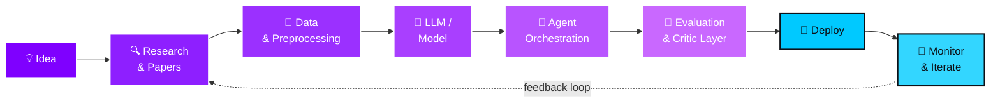

<div align="center">

<!-- ============================================================ -->
<!--                    HERO BANNER SECTION                       -->
<!-- ============================================================ -->


<!-- Animated Typing Effect -->
<a href="https://git.io/typing-svg">
  
</a>

<br/>

<!-- Profile Counter -->


<br/><br/>
<!-- Divider -->


</div>

<div align="center">

[](https://019bd04c-c745-7394-8d8a-c56f1e94c06a.arena.site)
[](https://linkedin.com/in/anmol-dhimannn)
[](mailto:anmoldhimandm@gmail.com)
[](https://github.com/anmoldhiman17)
[](https://drive.google.com/file/d/1-_OOccEqvVfkKxcyu-XO2c0gtBEtahIl/view?usp=sharing)
</div>

<div align="center">


</div>

<br/>

<div align="center">

</div>

---

## 📑 Navigation

<div align="center">

[`🧠 About`](#-about-me) &nbsp;•&nbsp; [`⚡ Quick Stats`](#quick-stats) &nbsp;•&nbsp; [`🚀 Currently Building`](#-currently-building) &nbsp;•&nbsp; [`🛠️ Tech Stack`](#️-tech-arsenal) &nbsp;•&nbsp; [`🎯 Strengths`](#-core-strengths) &nbsp;•&nbsp; [`🧪 AI Expertise`](#-ai-expertise) &nbsp;•&nbsp; [`💼 Experience`](#-professional-experience) &nbsp;•&nbsp; [`📈 Impact`](#-impact-in-numbers) &nbsp;•&nbsp; [`💎 Projects`](#-featured-projects) &nbsp;•&nbsp; [`📊 Analytics`](#-github-analytics) &nbsp;•&nbsp; [`🎓 Education`](#-education) &nbsp;•&nbsp; [`🏆 Achievements`](#-achievements--certifications) &nbsp;•&nbsp; [`⚙️ Workflow`](#️-dev-workflow) &nbsp;•&nbsp; [`📡 Learning`](#-currently-learning) &nbsp;•&nbsp; [`🤝 Connect`](#-lets-connect)

</div>

---

<div align="center">

</div>

## 🧠 About Me

<table align="center" width="100%">
<tr>
<td>

> 🔥 **I build AI systems, not just demos.**

I'm an AI Engineer obsessed with what happens *after* the impressive notebook output — when an idea has to survive **real traffic**, **real users**, and **real edge cases** — wrapped in an API, deployed, monitored, and still running clean at 3 AM.

My world is **Large Language Models** and the architecture around them:
- 🕸️ **Multi-agent pipelines** where Search, Reader, Writer, and Critic agents each own exactly one job
- 📚 **Retrieval systems** tuned to fetch the *right* thing — not just *something*
- 🧠 **Chatbots with real memory** — not amnesiacs that forget you two messages in

I started with classical ML — `GridSearchCV`, validation curves, overfitting budgets — which is exactly why I care about **evaluation and robustness** in LLM systems today. A flashy demo that breaks on imperfect input isn't a product.

Pursuing **B.Tech CSE** at Quantum University, Roorkee — while interning, shipping projects, and publishing research — because the fastest way to learn AI engineering is to keep building things that break, then fixing them in public.

<br/>

> *"I don't just want to use AI — I want to architect the systems that make AI useful."*

</td>
</tr>
</table>

<br/>

<a name="quick-stats"></a>
<div align="center">


</div>

<p align="right"><a href="#top">↑ back to top</a></p>

---

<div align="center">

</div>

## 🚀 Currently Building

<div align="center">

| 🔭 Focus Area | 🔋 Energy | ⚡ Status |
|:---|:---:|:---|
| 🧬 **Generative AI** apps with multi-model orchestration | `████████░░` 80% | 🟢 Actively shipping |
| 🤖 **Autonomous Agents** — plan, reason, retrieve, self-correct | `███████░░░` 70% | 🟡 In active development |
| 🧠 **LLM-powered products** with production reliability | `█████████░` 90% | 🟢 Actively shipping |
| ⚙️ **FastAPI / Streamlit** backends serving AI at scale | `████████░░` 80% | 🟢 Actively shipping |
| 📚 **RAG pipelines** with hybrid retrieval & re-ranking | `███████░░░` 70% | 🔵 Refining |
| 🧪 **Model fine-tuning & evaluation** workflows | `█████░░░░░` 50% | 🟡 Experimenting |
| 🌐 **Open Source** contributions to AI tooling | `██████░░░░` 60% | 🔵 Ongoing |

</div>

<p align="right"><a href="#top">↑ back to top</a></p>

---

<div align="center">

</div>

## 🛠️ Tech Arsenal

<div align="center">

### 💻 Languages & Core


### 🤖 Generative AI & LLM Stack


### 📊 Machine Learning & NLP


### ⚙️ Backend & APIs


### 🎨 Frontend


### 🗄️ Databases & Vector Stores


### ☁️ DevOps, Cloud & Tools


</div>

<p align="right"><a href="#top">↑ back to top</a></p>

---

<div align="center">

</div>

## 🎯 Core Strengths

<div align="center">


</div>

<br/>

<div align="center">

| Strength | What it looks like IRL |
|:---|:---|
| 🔬 **Research-first mindset** | Every project starts with reading the paper or docs — not cloning the tutorial |
| 🧪 **Evaluation discipline** | I measure before I claim — accuracy deltas, latency budgets, validation curves. Not vibes. |
| 🤝 **Cross-functional collaboration** | Comfortable across ML, backend, and frontend to ship a complete product end-to-end |
| 🎤 **Communication** | Organized and led technical events — explaining complex ideas clearly is a habit |
| 🏗️ **Ownership** | I'd rather ship something smaller that actually works than something bigger that's a demo forever |
| ⚡ **Speed + Quality** | Bias for shipping early, iterating fast, and not letting perfect block good |

</div>

<p align="right"><a href="#top">↑ back to top</a></p>

---

<div align="center">

</div>

## 🧪 AI Expertise

<div align="center">

| Domain | Skill Bar | Level |
|:---|:---|:---:|
| 🤖 **LLM Applications** | `█████████░` | 92% |
| ✍️ **Prompt Engineering** | `█████████░` | 90% |
| 📚 **RAG Systems** | `████████░░` | 88% |
| 🔗 **LangChain / LCEL** | `████████░░` | 88% |
| 🧮 **Classical ML & Model Tuning** | `████████░░` | 89% |
| 🕸️ **Multi-Agent Architectures** | `████████░░` | 86% |
| ☁️ **AI Deployment** | `████████░░` | 87% |
| 📝 **NLP & Text Classification** | `████████░░` | 86% |
| 🧩 **Embeddings & Vector Search** | `████████░░` | 84% |
| 🗄️ **Vector Databases** | `████████░░` | 82% |
| ⚙️ **Workflow Automation** | `████████░░` | 80% |
| 🎛️ **Model Fine-Tuning** | `███████░░░` | 75% |

</div>

<p align="right"><a href="#top">↑ back to top</a></p>

---

<div align="center">

</div>

## 💼 Professional Experience

<details open>
<summary><b>🟣 AI/ML Intern — Global Next Consulting India Pvt Ltd</b> &nbsp; <code>July 2025 – Sept 2025</code></summary>
<br/>


- 📈 Built and optimized supervised ML models, boosting prediction accuracy from **74% → 86%** (a **+12pp** lift).
- 🎯 Applied **K-Fold cross-validation** + **GridSearchCV** hyperparameter tuning — improved validation accuracy **+12%** and cut over-fitting by **18%**.
- 🔍 Conducted full-cycle EDA and feature transformation with Pandas & NumPy, strengthening model stability and preprocessing efficiency.

</details>

<br/>

<details>
<summary><b>🟣 Python Developer Intern — The Skybrisk (Remote)</b> &nbsp; <code>Oct 2025 – Mar 2026</code></summary>
<br/>


- ⚡ Automated backend workflows in Python, cutting manual processing time by **35%** and boosting execution efficiency by **25%**.
- 🔌 Integrated REST APIs for dynamic data exchange across services, lowering response latency by **22%** and strengthening system reliability.
- 🌱 Established Git-based version control workflows, reducing merge conflicts by **30%** and streamlining collaborative development.

</details>

<br/>

<details>
<summary><b>🟣 Full Stack Developer Intern — Anonic Technologies Pvt Ltd</b> &nbsp; <code>July 2024 – Aug 2024</code></summary>
<br/>


- 🖥️ Developed responsive web applications integrating frontend UIs with backend APIs, accelerating page load performance by **20%**.
- 🗃️ Structured and enhanced MySQL queries for efficient data retrieval and optimized application performance.
- 🔐 Built authentication logic and dynamic rendering for a seamless, secure user experience.

</details>

<p align="right"><a href="#top">↑ back to top</a></p>

---

<div align="center">

</div>

## 📈 Impact in Numbers

<div align="center">

> *Every bullet on my résumé has a number. Here they are, all in one place.*

| 📊 Metric | 🔢 Result | 📍 Where |
|:---|:---:|:---|
| 🎯 Prediction accuracy improvement | **74% → 86%** | AI/ML Internship |
| 🧮 Validation accuracy gain (GridSearchCV) | **+12%** | AI/ML Internship |
| 📉 Overfitting reduction | **−18%** | AI/ML Internship |
| ⚡ Manual processing time cut | **−35%** | Python Developer Internship |
| 🚀 Execution efficiency gain | **+25%** | Python Developer Internship |
| 🔌 API response latency reduction | **−22%** | Python Developer Internship |
| 🌱 Merge conflict reduction | **−30%** | Python Developer Internship |
| 🖥️ Page load performance boost | **+20%** | Full Stack Internship |
| 📧 Spam classifier accuracy | **97%** | Spam Email Classification Project |

</div>

<div align="center">


</div>

<p align="right"><a href="#top">↑ back to top</a></p>

---

<div align="center">

</div>

## 💎 Featured Projects

<table align="center" width="100%">

<tr>
<td width="50%" valign="top">

### 🧬 ResearchMind
> **Multi-Agent AI Research System**

Production-grade pipeline built with **LCEL** orchestrating four specialized agents — `Search`, `Reader`, `Writer`, `Critic` — via shared state, automating end-to-end research workflows from topic ingestion to a scored, structured report.

**Stack:** `Python` · `LangChain` · `LCEL` · `LLMs` · `Streamlit` · `Tavily`


[](https://github.com/anmoldhiman17?tab=repositories)

</td>
<td width="50%" valign="top">

### 🎭 Orion AI
> **Multi-Personality LLM Chatbot**

Powered by **Mistral + LangChain** with 5 distinct AI personas, unique prompt-engineering templates per mode, real-time streaming, full session memory, and one-click persona switching with zero context loss. Live on Hugging Face Spaces.

**Stack:** `Python` · `LangChain` · `Mistral AI` · `Streamlit` · `HuggingFace Spaces`


[](https://github.com/anmoldhiman17?tab=repositories)

</td>
</tr>

<tr>
<td width="50%" valign="top">

### 📄 NeuralDocs AI
> **RAG-Powered PDF Assistant**

Holds grounded, citation-aware conversations with dense, lengthy documents. Built on a **vector retrieval pipeline** tuned for accuracy over raw recall — knows *where* it found what it says.

**Stack:** `LangChain` · `ChromaDB` · `Mistral` · `Streamlit`


[](https://github.com/anmoldhiman17?tab=repositories)

</td>
<td width="50%" valign="top">

### 🏙️ AI City Assistant
> **Location-Aware Conversational Agent**

Fuses **live weather + maps data** with LLM reasoning to answer real-time, real-world city queries — a demo of tool-augmented AI that does something GPT alone can't.

**Stack:** `Mistral` · `Weather API` · `Maps` · `LangChain`


[](https://github.com/anmoldhiman17?tab=repositories)

</td>
</tr>

<tr>
<td width="50%" valign="top">

### 📧 Spam Email Classifier
> **97% Accuracy Text Classification System**

Supervised **NLP pipeline** using TF-IDF + Logistic Regression benchmarked against a **TensorFlow Dense Neural Network**. Full preprocessing chain — tokenization, stop-word removal, normalization.

**Stack:** `Scikit-learn` · `TensorFlow` · `NLP` · `TF-IDF`


[](https://github.com/anmoldhiman17?tab=repositories)

</td>
<td width="50%" valign="top">

### 🎬 MovieMind AI
> **AI Movie Intelligence Engine**

Advanced **prompt engineering** for nuanced, context-aware film recommendations and deep-dive analysis — more than a chatbot, less than magic.

**Stack:** `Prompt Engineering` · `Mistral`


[](https://github.com/anmoldhiman17?tab=repositories)

</td>
</tr>

</table>

<div align="center">

[](https://github.com/anmoldhiman17?tab=repositories)

</div>

<p align="right"><a href="#top">↑ back to top</a></p>

---

<div align="center">

</div>

## 📊 GitHub Analytics

<div align="center">


</div>

<div align="center">


</div>

<div align="center">

<br/>


</div>

<div align="center">

<br/>


</div>

<p align="right"><a href="#top">↑ back to top</a></p>
<!-- Snake Game Repo View -->

<div align="center">
  
</div>
---

<div align="center">

</div>

## 🎓 Education

<div align="center">

<table width="80%">
<tr>
<td align="center">

<h3>🏛️ Bachelor of Technology — Computer Science Engineering</h3>

**Quantum University, Roorkee**

<br/>


<br/>

Core coursework in **Data Structures & Algorithms**, **Machine Learning**, **Deep Learning**, and **Database Systems** — not left in a textbook, but applied immediately through 3 internships, 6 shipped projects, and a published research paper.

</td>
</tr>
</table>

</div>

<p align="right"><a href="#top">↑ back to top</a></p>

---

<div align="center">

</div>

## 🏆 Achievements & Certifications

<div align="center">

| 🏷️ Category | 📋 Highlight | 📅 Year |
|:---|:---|:---:|
| 📜 **Research Publication** | Published ML paper on predictive analysis & model optimization — **IJPREMS** | 2025 |
| ✍️ **Prompt Engineering** | 9-hour advanced LLM optimization & AI automation course — **Udemy** | 2026 |
| 🤖 **Generative AI** | Hands-on GenAI & LLM fundamentals workshop — **GrowthSchool** | 2026 |
| 🧠 **AI Systems Workshop** | Applied AI assistant systems for real-world dev — **UNLOX** | 2026 |
| 🎤 **Technical Event Lead** | Organized *Code Cracker* & *Crack the Quiz* — design, eval, coordination | 2025 |
| 🎓 **B.Tech CSE** | Quantum University, Roorkee — **7.14 / 10 CGPA** | 2023–27 |

</div>

<div align="center">


</div>

<p align="right"><a href="#top">↑ back to top</a></p>

---

<div align="center">

</div>

## ⚙️ Dev Workflow

<div align="center">



</div>

<p align="right"><a href="#top">↑ back to top</a></p>

---

<div align="center">

</div>

## 📡 Currently Learning

<div align="center">


</div>

<p align="right"><a href="#top">↑ back to top</a></p>

---

<div align="center">

</div>

## 🗣️ Languages

<div align="center">

| Language | Proficiency |
|:---|:---|
| 🇬🇧 **English** |  |
| 🇮🇳 **Hindi** |  |

</div>

<p align="right"><a href="#top">↑ back to top</a></p>

---

<div align="center">

</div>

## 📬 Open to Collaborate If You're...

<div align="center">

<table width="80%">
<tr><td>

- 🏢 Hiring for an **AI/ML Engineer**, **GenAI Engineer**, **LLM Developer**, or **Agent Architect** role
- 🤝 Looking for a collaborator on **open-source AI tooling** — especially LangChain, RAG, or eval frameworks
- 🧪 Working on **RAG / multi-agent systems / LLM evaluation** and want a second pair of eyes
- 🎤 Organizing a **hackathon, workshop, or technical event** and need a speaker, organizer, or judge
- 💡 Just want to debate how to make AI systems **actually reliable** — not just impressive in a demo

</td></tr>
</table>

</div>

---

<div align="center">

</div>

## 🤝 Let's Connect

<div align="center">

[](https://linkedin.com/in/anmol-dhimannn)
[](https://019bd04c-c745-7394-8d8a-c56f1e94c06a.arena.site)

<br/>

[](https://github.com/anmoldhiman17)
[](mailto:anmoldhimandm@gmail.com)

</div>

<br/>

<div align="center">

### 💬 Quote


</div>

<br/>

<div align="center">

</div>

---

<details>
<summary>💡 <b>Setup Notes</b> (read before pushing — remove this section after)</summary>
<br/>

**Things to fill in before going live:**

- **Resume button:** Replace `#` next to the Resume shield with your actual Google Drive / hosted PDF link.
- **Project demo links:** Each project's "Live Demo" badge currently has no `href`. Wrap them as `[](your-demo-url)` once you have live URLs.
- **Snake animation:** The SVG at the bottom of GitHub Analytics won't show until you add the GitHub Action. Create `.github/workflows/snake.yml` in your `anmoldhiman17` repo:

```yaml
name: snake
on:
  schedule:
    - cron: "0 0 * * *"
  workflow_dispatch: {}
  push:
    branches: [ main ]
jobs:
  generate:
    runs-on: ubuntu-latest
    steps:
      - uses: Platane/snk@v3
        with:
          github_user_name: anmoldhiman17
          outputs: dist/github-contribution-grid-snake.svg
      - uses: crazy-max/ghaction-github-pages@v4
        with:
          target_branch: output
          build_dir: dist
        env:
          GITHUB_TOKEN: ${{ secrets.GITHUB_TOKEN }}
```

- **Stats cards reliability:** `github-readme-stats`, `streak-stats`, and `github-profile-trophy` are free public Vercel instances and sometimes rate-limit or pause. If a card breaks, self-host your own copy on Vercel (one-click from each tool's GitHub repo) and swap the domain.

</details>
